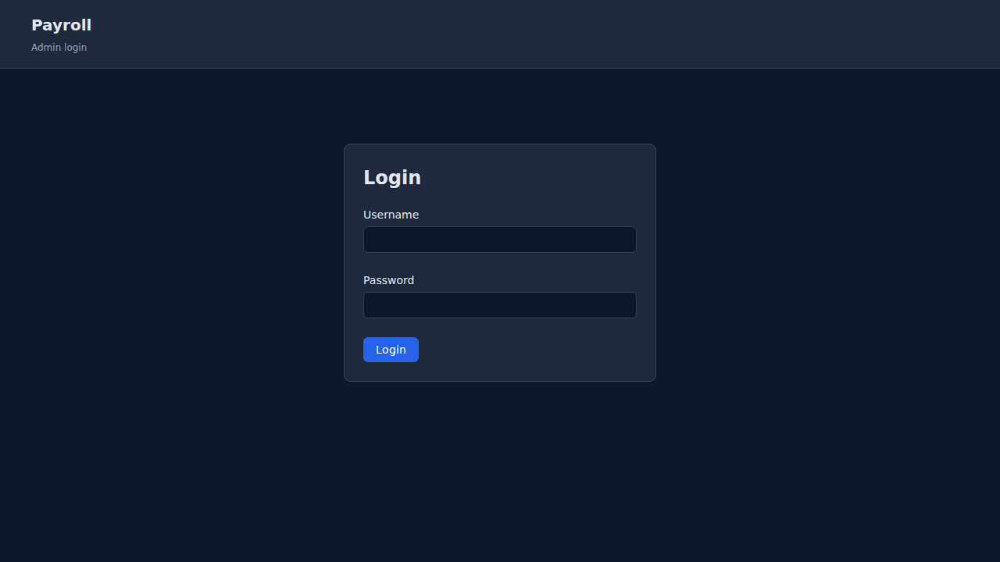
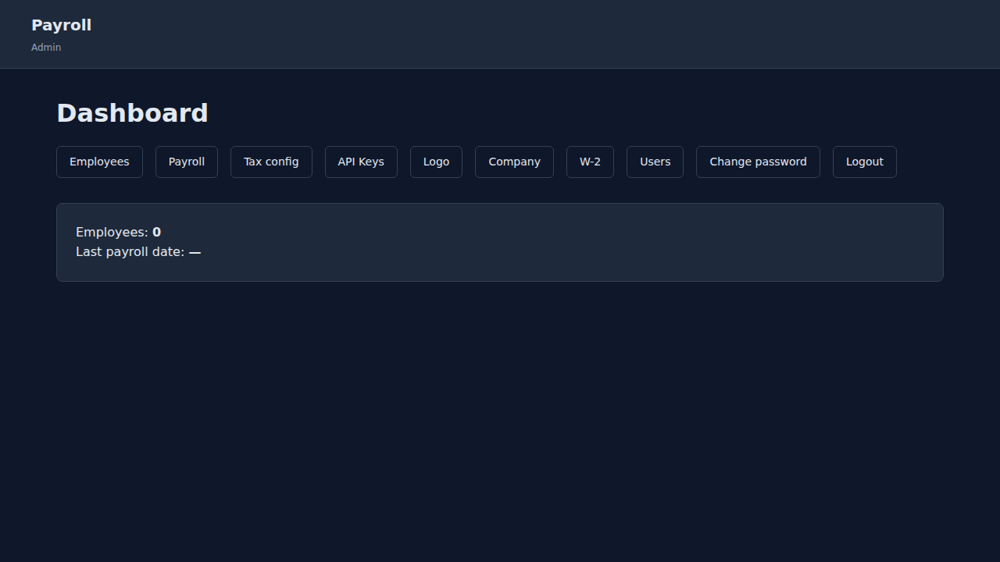
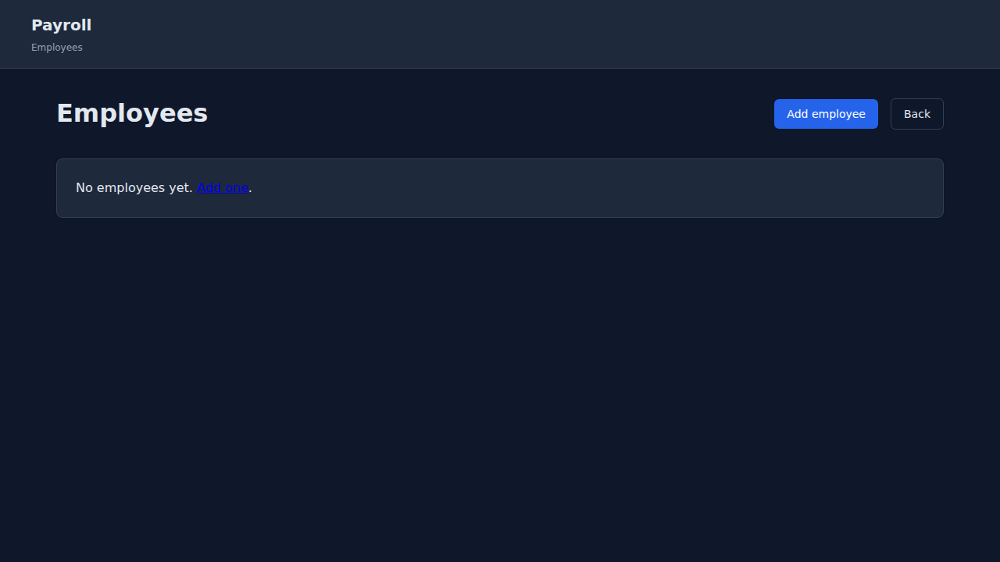
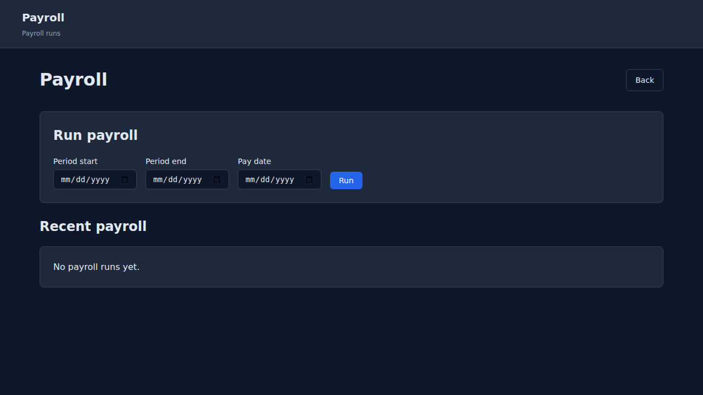
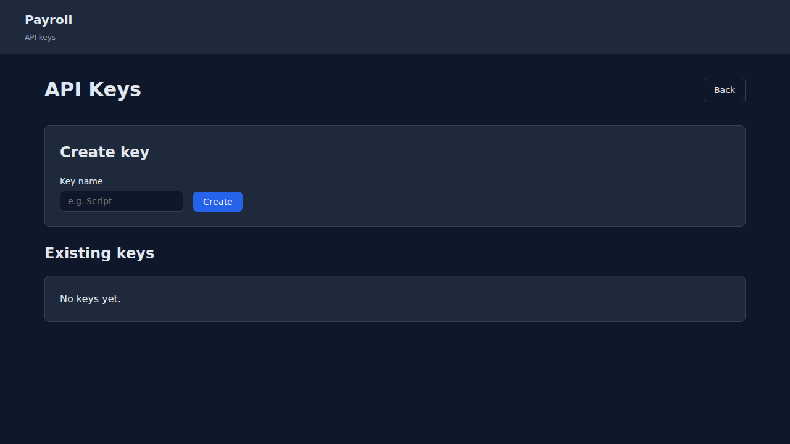
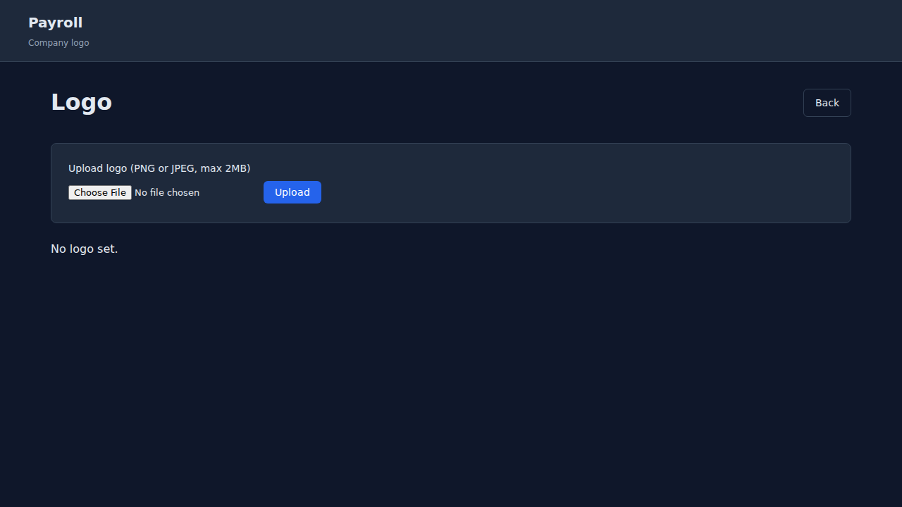
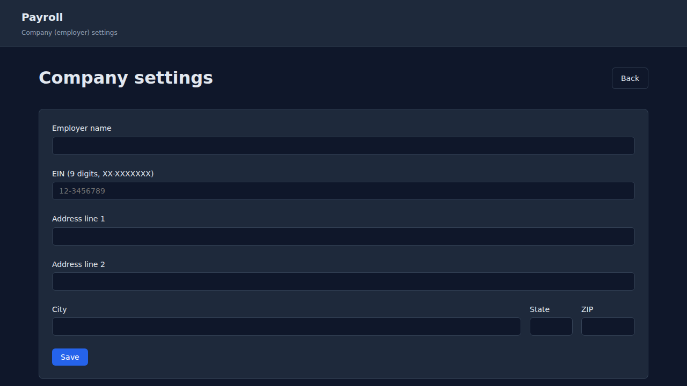
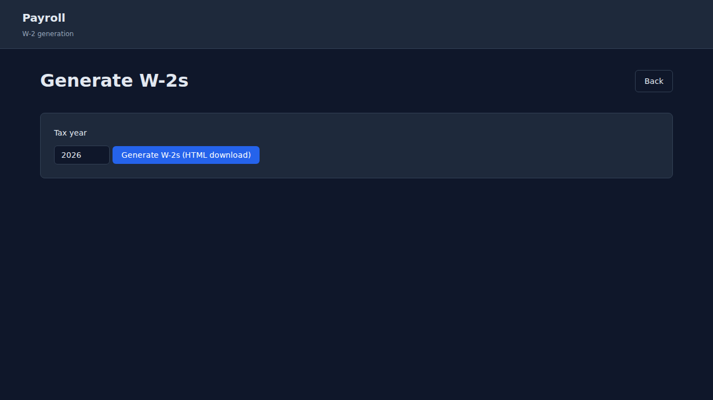
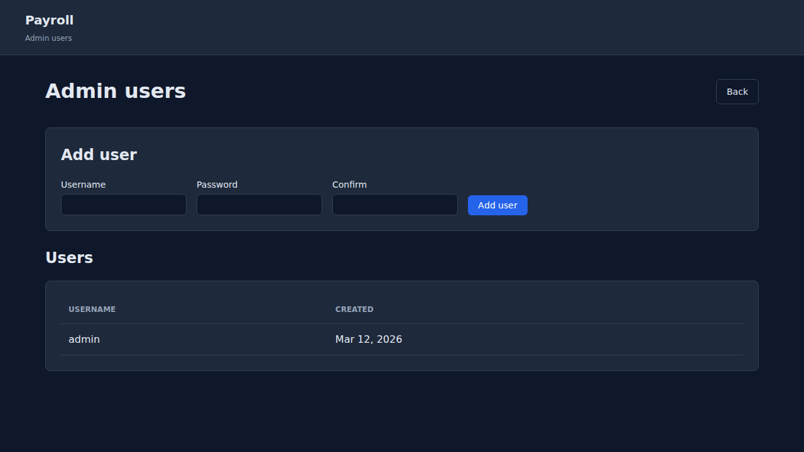
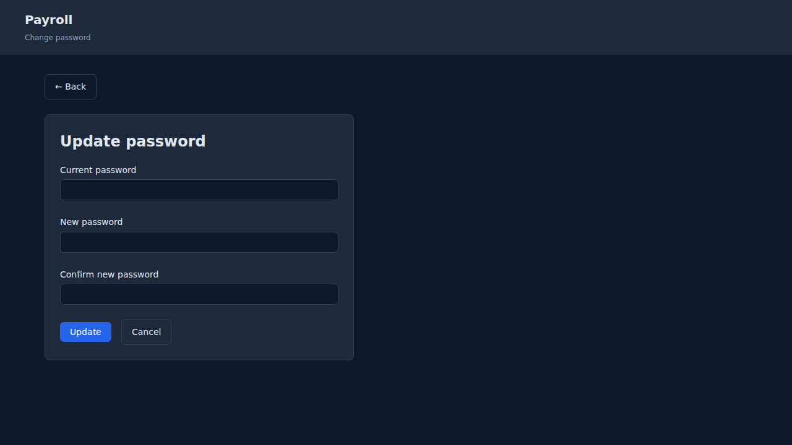

# Visual walkthrough — Payroll Admin UI

This guide walks through the Payroll admin interface with screenshots. The screenshots were captured from a live installation and show the main pages and navigation.

---

## 1. Login

Open `/admin/login.php` and sign in with your admin username and password. After a successful login you are redirected to the dashboard.



---

## 2. Dashboard

The dashboard (`/admin/index.php`) shows a quick summary: employee count and last payroll date. From here you can reach all other admin sections via the navigation links.



---

## 3. Employees

**URL:** `/admin/employees.php`

List all employees (name, masked SSN, filing status, hire date, monthly gross). Use **Add employee** to create a new employee; **Edit** to change details (name, SSN, filing status, hire date, salary, address, W-4 options); **Delete** to remove an employee (only if they have no payroll history).



---

## 4. Payroll

**URL:** `/admin/payroll.php`

- **Run payroll:** Enter pay period start, pay period end, and pay date, then click **Run**. The form calls the run-payroll API (at least one API key must exist).
- **Recent payroll:** Table of recent runs with **Stub** links to open the HTML pay stub in a new tab.



---

## 5. Tax config

**URL:** `/admin/tax-config.php`

Lists configured tax years. Use **Upload** to paste JSON tax config (see [TAX-CONFIG.md](TAX-CONFIG.md)) and upload via the API. Uses the first API key for the request.


---

## 6. API Keys

**URL:** `/admin/api-keys.php`

Create API keys for the REST API and SMCP plugin. Enter a name and click **Create**; the key is shown once—copy and store it securely. The list shows key name, truncated key, created date, and last used. **Delete** removes a key (cannot be undone).



---

## 7. Logo

**URL:** `/admin/logo.php`

Upload a company logo (PNG or JPEG, max 2 MB). Replaces any existing logo. The logo is used on pay stubs and shown in the admin logo preview.



---

## 8. Company (employer settings)

**URL:** `/admin/company-settings.php`

Set employer name, EIN (9 digits), and address. Required for W-2 generation. EIN is validated (9 digits).



---

## 9. W-2

**URL:** `/admin/w2.php`

Choose a tax year and click **Generate W-2s** to download an HTML file with one W-2-style section per employee who has payroll and a complete address. Open in a browser and use Print → Save as PDF for PDFs. Requires company settings and employee addresses for included employees.



---

## 10. Users

**URL:** `/admin/users.php`

Add admin users (username and password with confirmation). All admins have full access (no roles). **Delete** removes a user; you cannot delete the last remaining admin.



---

## 11. Change password

**URL:** `/admin/change-password.php`

Change the current user’s password. Requires current password and new password (min 8 characters) with confirmation.



---

## Capturing new screenshots

Screenshots are generated with Playwright from the repo:

1. Create and use the Playwright venv:
   ```bash
   python3 -m venv .venv-playwright
   .venv-playwright/bin/pip install playwright
   .venv-playwright/bin/playwright install chromium
   ```

2. Run the capture script (set the live site URL and admin password):
   ```bash
   PAYROLL_BASE_URL=https://your-payroll-site.com \
   PAYROLL_PASSWORD=your-admin-password \
   .venv-playwright/bin/python scripts/capture_admin_walkthrough.py
   ```

Screenshots are written to `docs/images/walkthrough/`. See [scripts/capture_admin_walkthrough.py](../scripts/capture_admin_walkthrough.py) for the list of pages captured.
